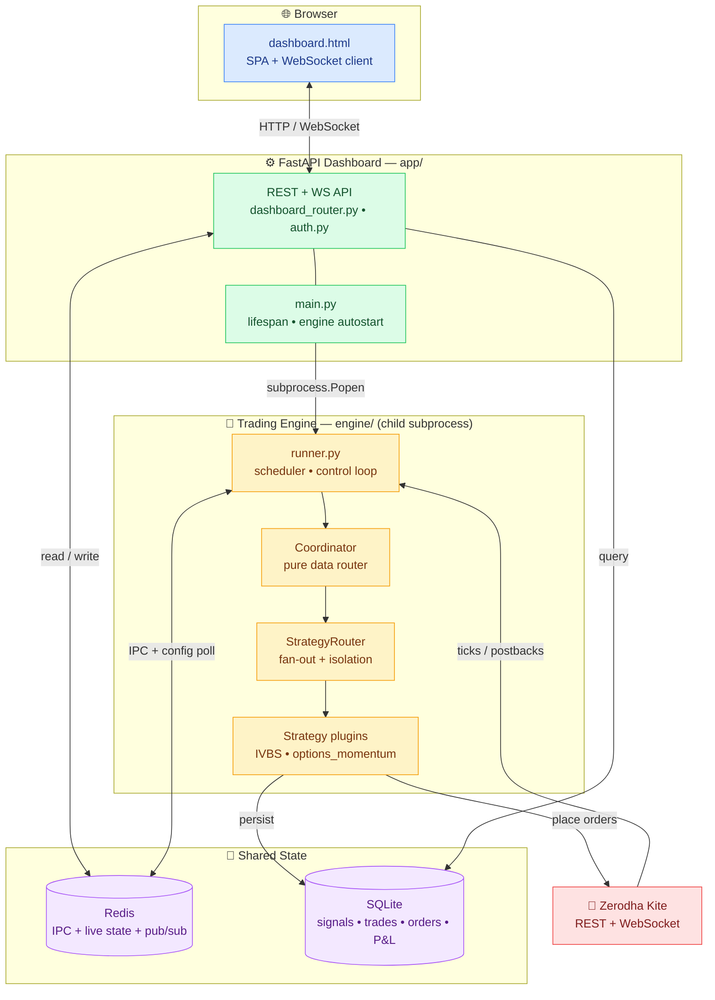
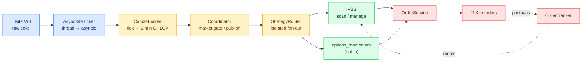
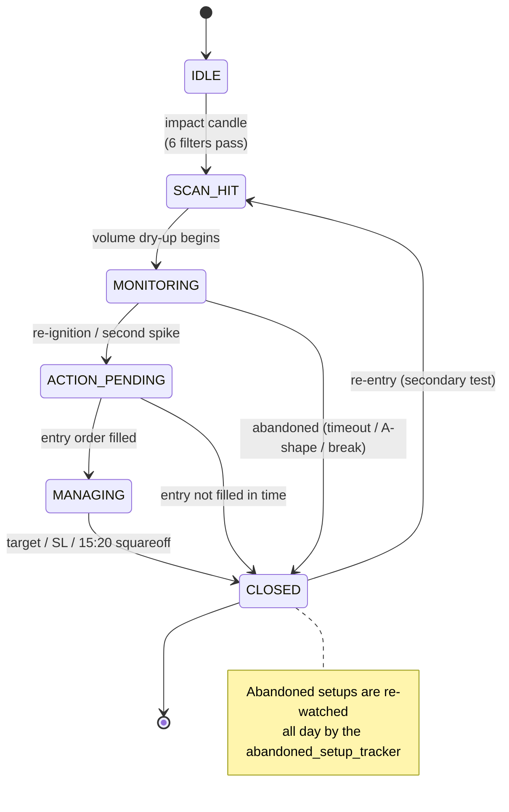
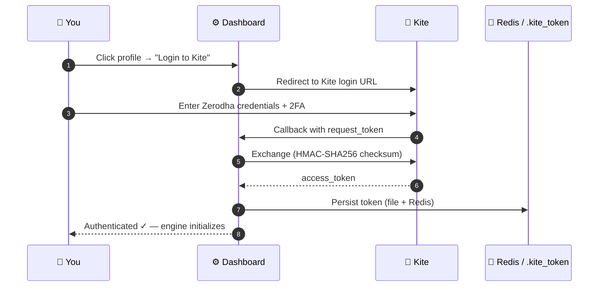
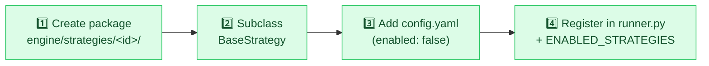
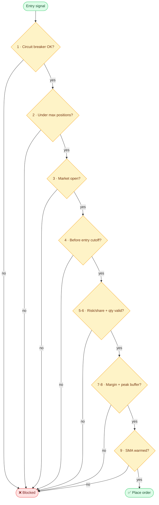

<div align="center">

# 📈 IVBS Trading Platform

### Institutional Volume Breakout Strategy — a multi-strategy, multi-asset intraday trading engine for NSE / F&O on Zerodha Kite


</div>

---

## 📑 Table of Contents

1. [What is IVBS?](#-what-is-ivbs)
2. [The IVBS strategy explained](#-the-ivbs-strategy-explained)
3. [System architecture](#️-system-architecture)
4. [How data flows (event funnel)](#-how-data-flows-event-funnel)
5. [The trading day timeline](#-the-trading-day-timeline)
6. [Repository layout — every module explained](#-repository-layout--every-module-explained)
7. [Data stores (Redis + SQLite)](#-data-stores)
8. [HTTP & WebSocket API reference](#-http--websocket-api-reference)
9. [Configuration reference](#️-configuration-reference)
10. [Setup & installation](#-setup--installation)
11. [Running the platform](#-running-the-platform)
12. [Kite authentication flow](#-kite-authentication-flow)
13. [Trading modes (PAPER / LIVE / SIMULTANEOUS)](#-trading-modes)
14. [Multi-strategy: run one, some, or add your own](#-multi-strategy-run-one-some-or-add-your-own)
15. [Backtesting](#-backtesting)
16. [Risk & safety systems](#-risk--safety-systems)
17. [Testing](#-testing)
18. [Troubleshooting](#-troubleshooting)
19. [Disclaimer](#-disclaimer)

---

## 🎯 What is IVBS?

IVBS is an **automated intraday trading system** for the Indian markets (NSE equities today, F&O ready) built on **Zerodha Kite Connect v3**. It watches a universe of stocks in real time, detects **institutional-scale volume breakouts**, waits for the classic **volume dry-up → re-ignition** confirmation, and then enters with a strict **1:4 risk-reward** target and automated stop-loss management.

The platform is split into **two cooperating processes** that communicate over **Redis** — a **FastAPI dashboard** (what you see and click) and a headless **trading engine** (what talks to the broker). The engine is a **plugin framework**: strategies are self-contained packages, so you can add a new equity/futures/options strategy **without editing the engine core**.

> [!NOTE]
> **Reference specification:** [`IVBS_Final_Spec.md`](IVBS_Final_Spec.md) is the canonical, in-depth strategy + production spec. This README is the engineering overview and operator's manual.

### ✨ Headline features

| Capability | Detail |
|---|---|
| 🔍 **Volume-breakout scanner** | 6 fail-fast institutional filters (volume spike, turnover, price band, sell-dump guard, SMA warm) |
| 🔄 **4-phase lifecycle** | Scan → dry-up monitoring → entry → managed exit, per symbol, all day |
| 🧠 **Confirmation logic** | Re-ignition, second-spike detection, and re-entry after abandonment (Wyckoff "secondary test") |
| 🎛️ **Three trade modes** | `PAPER`, `LIVE`, and `SIMULTANEOUS` (paper + live side-by-side), switchable at runtime |
| 🛡️ **Layered risk** | Circuit breaker, SEBI peak-margin tracking, 9-step pre-trade checks, position sizing |
| ⚡ **Real-time dashboard** | WebSocket-pushed ticks, positions, scanner, P&L, approvals, editable watchlist |
| 🧩 **Plugin strategies** | Add a strategy = one package + one line; core untouched. IVBS + options-momentum ship in-box |
| 📊 **Backtesting** | Replay your *real* strategy over historical candles + measured metrics (win rate, PF, expectancy) |
| ♻️ **Crash-safe** | 5-min reconcile loop, orphan detection, Redis NX exit locks, idempotent postbacks |

---

## 📚 The IVBS strategy explained

The strategy hunts for stocks where a sudden, **institutional-sized** buying spike appears, then confirms the move is real before committing capital.

### Phase 1 — Scan (find the "impact candle")

Every completed 1-minute candle in the universe is tested against **six fail-fast filters** (all must pass):

| # | Filter | Default | Why |
|---|--------|---------|-----|
| 1 | Volume SMA is warmed | 500-period | Need a baseline to compare against |
| 2 | **Volume spike** ≥ N × SMA | `15×` | Institutional footprint, not retail noise |
| 3 | **Turnover** ≥ ₹N crore | `₹8 Cr` | Enough liquidity to enter/exit cleanly |
| 4 | Price in band | `₹50–₹5000` | Avoid penny stocks and ultra-expensive scrips |
| 5 | **Green candle** (close ≥ open × 0.995) | — | Reject sell-side dumps masquerading as volume |
| 6 | Time window | `09:30–14:00` | Skip opening noise; leave a buffer before close |

A pass creates a **SCAN_HIT** and records the *impact candle* (its high/low/close become the reference levels).

### Phase 2 — Monitoring (wait for the dry-up)

After the spike, real institutional accumulation shows a **volume dry-up** — quiet consolidation candles where price holds above the impact low. The state machine tracks this "consolidation zone" for up to `DRYUP_MAX_MINUTES` (20 min). The setup is **abandoned** if:

- price breaks below the impact low (buffer `0.3%`),
- an **A-shape** reversal appears (heavy red candle on rising volume),
- or the dry-up times out.

### Phase 3 — Entry (the re-ignition)

Entry triggers when volume **re-ignites** out of the dry-up:

- **Re-ignition path** — volume > mean(dry-up) × `2.0` **and** ≥ `8%` of the impact volume, price closes above the consolidation high (measured on a *pre-update* snapshot to avoid look-ahead bias), candle is green, before `13:30`.
- **Second-spike path** — a fresh spike `50–100%` the size of the first wave, price above the first spike's high (research-backed continuation).

Entry is a **limit order** at `close × 1.003`, sized by the **1% risk rule**.

### Phase 4 — Management (the exit ladder)

Stop-loss starts at **swing-low wick − 1 tick**. The default exit ladder is a **fixed-step trail** toward a **1:4** target:

```text
2R reached ─▶ move SL to breakeven
3R reached ─▶ lock +1R profit
4R reached ─▶ market exit (target hit)
15:20      ─▶ time-based squareoff (whatever the state)
```

> [!TIP]
> Optional **volatility-adaptive** exits are available behind config flags (default off): a **Chandelier ATR trailing stop** (`DYNAMIC_TRAILING_ENABLED`) and a **VWAP entry filter** (`VWAP_ENTRY_FILTER_ENABLED`). The proven 1:4 fixed ladder remains the default.

### Re-entry (the "secondary test")

If a setup is abandoned (except on a hard `price_broke_impact_low`), the [abandoned setup tracker](engine/strategy/abandoned_setup_tracker.py) keeps re-watching it all day. A **re-entry** fires on a smaller `5×` spike (vs `15×`), after a `15`-min gap, if price reclaims the impact close — up to `2×` per symbol. This captures Wyckoff-style secondary tests without chasing failed breakouts.

---

## 🏗️ System architecture

Two processes, one Redis bus. The dashboard **never** touches the engine's memory directly — everything crosses the boundary through Redis.



### Why two processes?

| Concern | Benefit |
|---|---|
| **Isolation** | A dashboard reload/crash never interrupts live position management |
| **Independent lifecycle** | The engine runs the market day; the UI can come and go |
| **Clean IPC** | Redis is the single source of truth — no shared mutable memory, no locks across the boundary |
| **Runtime control** | Dashboard writes commands (`STOP`, `TRADE_MODE`, watchlist); engine's `_poll_config()` applies them every 5 s |

### The design rule that matters

- **Coordinator** ([engine/strategy/coordinator.py](engine/strategy/coordinator.py)) is a **pure data router** — candle building, Nifty/VIX market gate, dashboard publishing, order reconcile. It makes **no** trading decisions.
- **StrategyRouter** ([engine/core/strategy_router.py](engine/core/strategy_router.py)) fans every lifecycle event to each registered strategy, wrapping every call in `try/except` so **one strategy's exception can never crash the engine or a sibling**.
- **BaseStrategy** ([engine/core/base_strategy.py](engine/core/base_strategy.py)) is the plugin contract. **All** trading logic lives behind it.

---

## 🔀 How data flows (event funnel)

Inside the engine, every market event travels through a strict funnel. The Coordinator prepares data; the Router distributes it; strategies decide.



### The per-symbol state machine

Each symbol runs an independent finite-state machine ([engine/strategy/state_machine.py](engine/strategy/state_machine.py)):



---

## 📅 The trading day timeline

The engine is driven by an **APScheduler** (IST timezone, `misfire_grace_time=300s`, `coalesce=True`, `max_instances=1`) plus a 5-second control loop.

```mermaid
flowchart LR
    A["🕘 09:00<br/>pre-market setup"] --> B["🔔 09:15<br/>market open"]
    B --> C["🔍 09:30<br/>scanning starts"]
    C --> D["⛔ 13:30<br/>last new entry"]
    D --> E["🚫 14:00<br/>last scan hit"]
    E --> F["⏳ 15:18<br/>early squareoff check"]
    F --> G["📤 15:20<br/>squareoff all"]
    G --> H["🌙 15:25<br/>session end"]

    classDef morning fill:#dcfce7,stroke:#22c55e,color:#14532d
    classDef mid fill:#fef3c7,stroke:#f59e0b,color:#78350f
    classDef close fill:#fee2e2,stroke:#ef4444,color:#7f1d1d
    class A,B,C morning
    class D,E mid
    class F,G,H close
```



| Time (IST) | Job | What happens |
|---|---|---|
| **09:00** | `job_pre_market_setup` | Validate token, fetch capital, reset daily state, load instruments, load/warm 500-SMA history, historical warmup, subscribe WS, orphan check |
| **09:15** | `job_market_open` | Reset candle builders, enable the scanner |
| 09:30 | *(scanner gate)* | Scanning begins (`SCANNER_START_MINUTE`) — skips opening auction noise |
| every **5 min** | `job_reconcile` | Catch any missed WS postbacks (safety net, spec §12.2) |
| **15:18** | `job_early_squareoff_check` | If more than one position is open, begin closing early for a time buffer |
| **15:20** | `job_squareoff` | Force-close **all** open positions |
| **15:25** | `job_session_end` | Persist SMA history, write daily P&L, unsubscribe WS, persist EOD snapshot, clear re-entry tracker |
| continuous | `_poll_config` (5 s) | Apply runtime `TRADE_MODE`/capital overrides, `STOP`/`START`/`EMERGENCY_STOP`, watchlist hot-reload |

> [!NOTE]
> **Late start is handled.** If you launch after 09:15, `job_pre_market_setup` runs immediately and, if the market is already open, `job_market_open` is triggered on the spot (warmup + subscribe + scan).

---

## 📁 Repository layout — every module explained

```text
Algo_trade-dev/
├── app/                      ⚙️  FastAPI dashboard (web layer)
├── engine/                   🚀  Trading engine (headless)
├── alembic/                  🗄️  Database migrations
├── scripts/                  🔧  Diagnostics + backtest CLI
├── tests/                    ✅  Unit + integration tests (295)
├── data/                     📦  SMA snapshots, sample backtest CSV
├── start.bat                 ▶️  One-click Windows launcher
├── docker-compose.yml        🐳  Redis (fallback to Memurai)
├── requirements.txt          📋  Runtime dependencies
├── universe.txt              📃  Symbols to scan (editable in UI)
├── nse_holidays.json         📆  NSE holiday calendar
└── IVBS_Final_Spec.md        📖  Canonical strategy specification
```

### ⚙️ `app/` — FastAPI web layer

| File | What it is |
|---|---|
| [app/main.py](app/main.py) | App entry point. Serves `/`, registers routers, and manages the **engine subprocess** via lifespan (autostart with Redis heartbeat locking to avoid duplicates). |
| [app/core/config.py](app/core/config.py) | **Pydantic Settings v2** — ~120 typed settings (credentials, filters, risk, timing, modes). Single source of truth for tunables. |
| [app/core/logging.py](app/core/logging.py) | `structlog` JSON logging config (machine-parseable logs). |
| [app/api/dashboard_router.py](app/api/dashboard_router.py) | All dashboard REST endpoints + the `/ws` WebSocket. Reads/writes Redis, queries SQLite, broadcasts live events. |
| [app/api/v1/routes/auth.py](app/api/v1/routes/auth.py) | Kite OAuth login/callback/status/logout (HMAC-SHA256 token exchange). |
| [app/models/db/](app/models/db/) | SQLAlchemy ORM models — `trade`, `signal`, `order_event`, `daily_pnl`, `signal_snapshot`, `strategy`, plus `base` (DeclarativeBase + timestamps). |
| [app/store/database.py](app/store/database.py) | Async SQLAlchemy 2.0 + `aiosqlite` engine, session factory, `init_db()`. |
| [app/store/redis_client.py](app/store/redis_client.py) | Lazy global Redis async connection pool. |
| [app/static/dashboard.html](app/static/dashboard.html) | The entire single-page dashboard (vanilla JS, no build step): live tables, charts, controls, dark mode, CSV export, strategy filter, paginated watchlist. |

### 🚀 `engine/` — trading engine

**Orchestration**

| File | What it is |
|---|---|
| [engine/runner.py](engine/runner.py) | The **main orchestrator**. Builds the StrategyRouter (gated by `ENABLED_STRATEGIES`), schedules all jobs, runs the control + config-poll loops, wires Kite after auth. |

**`engine/core/` — the plugin framework (never edit for a new strategy)**

| File | What it is |
|---|---|
| [engine/core/base_strategy.py](engine/core/base_strategy.py) | The `BaseStrategy` contract — lifecycle hooks (`on_market_open`, `on_candle`, `on_tick`, `on_order_postback`, `on_squareoff`, …) and dependency injection. |
| [engine/core/strategy_router.py](engine/core/strategy_router.py) | `StrategyRouter` — registers strategies and fans events out with per-strategy exception isolation. |
| [engine/core/strategy_config.py](engine/core/strategy_config.py) | Fail-soft loader for each strategy's `config.yaml` (returns `{}` on any error). |
| [engine/core/instrument.py](engine/core/instrument.py) | Broker-agnostic `Instrument` value object + `AssetClass`/`Exchange`/`Product`/`OptionType` enums (equity + F&O). |
| [engine/core/order_gateway.py](engine/core/order_gateway.py) | Abstract order interface (`OrderRequest`/`OrderResult`) shared by the Kite adapter and paper simulator. |

**`engine/kite/` — Zerodha integration**

| File | What it is |
|---|---|
| [engine/kite/auth.py](engine/kite/auth.py) | Token load/validate/save (file → Redis priority). |
| [engine/kite/client.py](engine/kite/client.py) | Async wrapper over KiteConnect REST (profile, margins, positions, orders, historical, place/modify/cancel). |
| [engine/kite/instruments.py](engine/kite/instruments.py) | `InstrumentCache` — O(1) symbol/token lookups from the Kite dump. |
| [engine/kite/ticker.py](engine/kite/ticker.py) | `AsyncKiteTicker` — bridges the KiteTicker WS thread into asyncio; manages subscriptions + reconnects. |

**`engine/market/` — market data + universe**

| File | What it is |
|---|---|
| [engine/market/calendar.py](engine/market/calendar.py) | NSE market-hours + holiday checks. |
| [engine/market/candle_builder.py](engine/market/candle_builder.py) | Per-symbol tick → 1-min OHLCV builder + rolling 500-volume SMA, ATR, and session VWAP. |
| [engine/market/historical_warmup.py](engine/market/historical_warmup.py) | Smart historical fetch — only pulls the *missing* days needed to warm the SMA. |
| [engine/market/universe.py](engine/market/universe.py) | Loads/filters the scan universe from `universe.txt`. |

**`engine/orders/` — placement + tracking**

| File | What it is |
|---|---|
| [engine/orders/order_service.py](engine/orders/order_service.py) | Places entries/SL/exits. Paper mode fills instantly; live mode retries with exponential backoff. |
| [engine/orders/order_tracker.py](engine/orders/order_tracker.py) | Routes Kite postbacks to the owning state machine; dedups on `(order_id, status)`. |
| [engine/orders/fill_timeout.py](engine/orders/fill_timeout.py) | Cancels unfilled entry limits after `ORDER_FILL_TIMEOUT_SECONDS`. |
| [engine/orders/cost_calculator.py](engine/orders/cost_calculator.py) | Full round-trip cost model (brokerage, STT, exchange/SEBI fees, GST, stamp duty). |

**`engine/risk/` — risk controls**

| File | What it is |
|---|---|
| [engine/risk/pre_trade_checks.py](engine/risk/pre_trade_checks.py) | Sequential 9-gate check — all must pass before an entry (bypasses wall-clock gates in `BACKTEST_MODE`). |
| [engine/risk/position_sizer.py](engine/risk/position_sizer.py) | 1%-risk share sizing + lot-based `compute_lots()` for F&O. |
| [engine/risk/circuit_breaker.py](engine/risk/circuit_breaker.py) | Daily-loss kill switch (`DAILY_LOSS_LIMIT_PCT`). |
| [engine/risk/margin_tracker.py](engine/risk/margin_tracker.py) | SEBI peak-margin tracking + broker sync. |

**`engine/store/` — persistence**

| File | What it is |
|---|---|
| [engine/store/redis_store.py](engine/store/redis_store.py) | **Central Redis interface** — every Redis op goes through this class (state, config, pub/sub, TTLs). |
| [engine/store/db_writer.py](engine/store/db_writer.py) | Async SQLite writes (signals, trades, orders, snapshots, daily P&L). |
| [engine/store/sma_file_store.py](engine/store/sma_file_store.py) | Gzipped on-disk SMA snapshot so warmup can skip re-fetching. |

**`engine/strategy/` — IVBS internals + Coordinator**

| File | What it is |
|---|---|
| [engine/strategy/coordinator.py](engine/strategy/coordinator.py) | Pure data router: candle build routing, Nifty/VIX gate, publish, orphan/reconcile, watchlist hot-reload. |
| [engine/strategy/scanner.py](engine/strategy/scanner.py) | Phase 1 impact-candle detection (the 6 filters). |
| [engine/strategy/state_machine.py](engine/strategy/state_machine.py) | Per-symbol FSM: monitoring, entry, SL/target trailing, exits. |
| [engine/strategy/second_spike_detector.py](engine/strategy/second_spike_detector.py) | Detects a second volume wave for direct entry. |
| [engine/strategy/abandoned_setup_tracker.py](engine/strategy/abandoned_setup_tracker.py) | Re-watches abandoned setups all day for re-entry. |

**`engine/strategies/` — the plugins**

| Package | What it is |
|---|---|
| `engine/strategies/ivbs/` | The production **IVBS** equity strategy (`strategy.py` + `config.yaml`). |
| `engine/strategies/options_momentum/` | Reference **index-options momentum** buyer (opt-in template for F&O). |

**`engine/backtest/` — offline replay**

| File | What it is |
|---|---|
| [engine/backtest/data_loader.py](engine/backtest/data_loader.py) | Load candles from CSV, `run_ivbs_backtest()`, and `fetch_candles_kite()` (live history helper). |
| `engine/backtest/engine.py` | `BacktestEngine` — replays your *real* strategy through the router with a `SimBroker` + fake Redis. |
| `engine/backtest/portfolio.py` | Accumulates simulated trades + equity curve. |
| `engine/backtest/metrics.py` | Pure metrics: win rate, profit factor, expectancy, max drawdown, Sharpe. |
| `engine/backtest/sim_broker.py` | Deterministic fill simulator. |

### 🔧 `scripts/` and root

| File | What it is |
|---|---|
| [scripts/run_backtest.py](scripts/run_backtest.py) | **Backtest CLI** — replay a CSV through IVBS and print the metrics JSON. |
| [scripts/redis_diag.py](scripts/redis_diag.py) | Inspect Redis (ping, keys, engine status/capital/ticks). |
| [scripts/kite_diag.py](scripts/kite_diag.py) | Kite API diagnostics (auth, profile, margins, WS). |
| [scripts/verify_system.py](scripts/verify_system.py) | Pre-flight check (imports, Redis/DB, config, token). |
| [scripts/kite_port80_redirect.py](scripts/kite_port80_redirect.py) | Redirect a port-80 Kite callback to the app (run as Admin). |
| [start.bat](start.bat) | One-click Windows launcher (auto-starts Redis, kills orphans, launches the app). |
| [alembic/](alembic/) | DB schema migrations (`alembic upgrade head`). |

---

## 💾 Data stores

### Redis — inter-process bus + live state

All Redis access is centralized in [engine/store/redis_store.py](engine/store/redis_store.py). Keys carry TTLs so stale cross-day data self-expires.

| Key | Type | TTL | Purpose |
|---|---|---|---|
| `session:token` | JSON | 24 h | Kite access token + metadata |
| `engine:status` | JSON | ~25 h | Engine status snapshot (stats, mode) |
| `engine:control` | String | — | `START` / `STOP` / `EMERGENCY_STOP` command |
| `engine:circuit_breaker` | String | ~25 h | Tripped `"true"`/`"false"` |
| `engine:daily_pnl` | Float | ~25 h | Realized P&L today |
| `engine:capital` | Float | ~25 h | Account equity (fetched 09:00) |
| `engine:blocked_margin` | Float | ~25 h | Margin committed to open positions |
| `engine:scanner:ready_count` / `:warming_count` | Int | ~25 h | Scanner readiness counters |
| `engine:config:trade_mode` / `:max_capital*` | String | — | Runtime overrides from the dashboard |
| `engine:runner:heartbeat` | JSON | 20 s | Liveness `{status, pid}` (autostart lock) |
| `engine:pending_watchlist` | JSON | 5 m | Watchlist edits awaiting hot-reload |
| `engine:strategies` | JSON | ~25 h | Active strategy IDs (drives UI selector) |
| `volume_sma:{symbol}` | JSON | 48 h | Rolling ≤500 volume deque |
| `livetick_hash` | Hash | 15 h | All live ticks (O(1) `HGETALL`) |
| `instrument_token:{symbol}` / `tick_size:{symbol}` | String | 24 h | Per-symbol metadata |
| `pub:signals` · `pub:orders` · `pub:state_changes` · `pub:pnl` · `pub:candles` | Pub/Sub | — | Real-time channels the dashboard subscribes to |

### SQLite — durable audit trail

Managed by SQLAlchemy async ([app/models/db/](app/models/db/)); migrations in [alembic/](alembic/).

| Table | Model | Contents |
|---|---|---|
| `trades` | `Trade` | Open/closed positions: entry/exit, SL levels, 1:2/1:3/1:4 targets, net P&L, `trade_mode`, `strategy_id` |
| `signals` | `Signal` | Phase-1 scan hits with impact OHLCV, spike multiple, progression + abandonment |
| `order_events` | `OrderEvent` | Full audit of every order event + raw Kite payload |
| `daily_pnl` | `DailyPnl` | EOD summary per session (signals, trades, gross/net, drawdown) |
| `signal_snapshots` | `SignalSnapshot` | Event-sourced state transitions (JSON context) |
| `strategies` | `Strategy` | One row per registered strategy plugin |

Every trade/signal/order carries a **`strategy_id`** (indexed) so multi-strategy data is cleanly separable.

---

## 🌐 HTTP & WebSocket API reference

Interactive docs are always available at **`/docs`** (Swagger UI). Base prefix: `/api/v1`.

### Dashboard endpoints — [app/api/dashboard_router.py](app/api/dashboard_router.py)

| Method | Path | Purpose |
|---|---|---|
| `GET` | `/status` | Engine status, capital, daily P&L, scanner counts, mode |
| `GET` | `/positions` | Active `MANAGING` positions with unrealized P&L |
| `GET` | `/scanner` | Today's scan hits (SQLite + live Redis state) — supports `?strategy_id=` |
| `GET` | `/signals` | Legacy scan-hit list |
| `GET` | `/orders` | Today's order events — supports `?strategy_id=` |
| `GET` | `/trades` | Closed trades + net P&L — supports `?strategy_id=` |
| `GET` | `/analytics` | Strategy performance (win rate, PF, expectancy, avg-R, max DD) — `?mode=&days=&strategy_id=` |
| `GET` | `/strategies` | Active strategy IDs (powers the UI selector) |
| `GET` | `/export/{trades\|orders\|journal}.csv` | Download full history as CSV |
| `GET` | `/export/snapshots` | Signal snapshots (JSON) |
| `GET` | `/circuit_breaker` | Circuit-breaker state + daily loss |
| `GET` / `POST` | `/approvals` | List / act on pending LIVE-entry approvals |
| `POST` | `/stop` | Graceful stop — block new entries, keep managing |
| `POST` | `/emergency_stop` | Halt + square-off everything |
| `POST` | `/start` | Resume scanning |
| `GET` / `POST` | `/settings` | Read / update runtime settings (mode, capital) |
| `GET` | `/market` | Live tick snapshot (EOD snapshot after close) |
| `GET` | `/universe` | Watchlist symbols with live state |
| `POST` / `DELETE` | `/universe/symbols` | Add / remove watchlist symbols (hot-reload) |
| `GET` | `/instruments/search` | Symbol autocomplete for watchlist editing |
| `GET` | `/pipeline` | Funnel counts (scan → monitor → action → managing) |
| `GET` | `/stock/{symbol}` | Per-symbol drill-down |
| `GET` | `/candles/{symbol}` | Recent candles for the chart |
| `GET` | `/journal` | Daily P&L journal |
| `WS` | `/ws` | Real-time push: 5 s heartbeat, 1 s tick batch, immediate pub/sub events |

### Auth endpoints — [app/api/v1/routes/auth.py](app/api/v1/routes/auth.py)

| Method | Path | Purpose |
|---|---|---|
| `GET` | `/auth/login` | Return the Kite login URL |
| `GET` | `/auth/login-redirect` | 302 to Kite (popup-safe) |
| `GET` | `/auth/callback` | Exchange `request_token` → `access_token`, persist |
| `GET` | `/auth/status` | Is a token saved and recent? |
| `DELETE` | `/auth/token` | Delete token (force re-login) |

Plus app-level: `GET /` (dashboard + callback catch), `GET /health`, `GET /docs`.

---

## ⚙️ Configuration reference

All settings live in [app/core/config.py](app/core/config.py) and are overridable via a `.env` file (or environment variables). Below are the most operationally important groups — the file is the complete source of truth.

### Credentials & infrastructure

| Setting | Default | Meaning |
|---|---|---|
| `KITE_API_KEY` / `KITE_API_SECRET` | *(required)* | Zerodha Kite Connect app credentials |
| `KITE_REDIRECT_URL` | `…/api/v1/auth/callback` | OAuth redirect |
| `REDIS_URL` | `redis://localhost:6379/0` | Redis connection |
| `DATABASE_URL` | `sqlite+aiosqlite:///./trading.db` | SQLite database |
| `UNIVERSE_FILE` | `universe.txt` | Symbols to scan |

### Trade mode & strategy selection

| Setting | Default | Meaning |
|---|---|---|
| `TRADE_MODE` | `PAPER` | `PAPER` \| `LIVE` \| `SIMULTANEOUS` |
| `ENABLED_STRATEGIES` | `ivbs` | Comma-separated strategy IDs to run |
| `BACKTEST_MODE` | `false` | Bypass wall-clock gates for offline replay |
| `AUTO_START_ENGINE_WITH_BACKEND` | `true` | Dashboard launches the engine subprocess |

### Strategy filters (Phase 1–3)

| Setting | Default | Meaning |
|---|---|---|
| `VOLUME_SPIKE_MULTIPLE` | `15.0` | Volume spike vs 500-SMA to qualify an impact candle |
| `VOLUME_SMA_PERIOD` | `500` | Rolling volume SMA window |
| `MIN_TURNOVER_CRORE` | `8.0` | Minimum ₹-crore turnover |
| `MIN_PRICE` / `MAX_PRICE` | `50` / `5000` | Price band |
| `DRYUP_MAX_MINUTES` | `20` | Max monitoring window |
| `REIGNITION_VOLUME_MULTIPLE` | `2.0` | Re-ignition vs dry-up mean |
| `SCANNER_START_MINUTE` | `30` | Start scanning at 09:30 |
| `RE_ENTRY_ENABLED` | `true` | Allow re-entry after abandonment |
| `NIFTY_GATE_ENABLED` | `true` | Block entries when Nifty is below its EMA |

<details>
<summary><b>Timing, risk, costs & advanced (click to expand)</b></summary>

**Timing**

| Setting | Default | Meaning |
|---|---|---|
| `MARKET_OPEN_TIME` | `09:15` | NSE open |
| `MAX_ENTRY_TIME` | `13:30` | No new entries after this |
| `SCAN_CUTOFF_HOUR` | `14` | No scan hits after 14:00 |
| `SQUARE_OFF_TIME` | `15:20` | Force-close all |
| `SESSION_END_TIME` | `15:25` | Session cleanup |
| `ORDER_FILL_TIMEOUT_SECONDS` | `30` | Cancel unfilled entry limit |
| `APPROVAL_TIMEOUT_SECONDS` | `60` | LIVE approval window |

**Risk controls**

| Setting | Default | Meaning |
|---|---|---|
| `RISK_PER_TRADE_PCT` | `1.0` | 1% risk rule |
| `MAX_CONCURRENT_POSITIONS` | `2` | Simultaneous open positions |
| `DAILY_LOSS_LIMIT_PCT` | `3.0` | Circuit breaker trips at −3% |
| `MIN_RISK_PER_SHARE_INR` | `5.0` | Minimum SL distance |
| `PEAK_MARGIN_SAFETY_BUFFER_PCT` | `15.0` | SEBI peak-margin buffer |

**Costs (SEBI/Zerodha)**

| Setting | Default | Meaning |
|---|---|---|
| `BROKERAGE_PER_ORDER_INR` | `20.0` | Flat brokerage/order |
| `STT_INTRADAY_SELL_PCT` | `0.00025` | STT on sell |
| `GST_ON_BROKERAGE_PCT` | `18.0` | GST on brokerage |
| `STAMP_DUTY_BUY_PCT` | `0.00003` | Stamp duty on buy |

**Advanced exits (opt-in, default off)**

| Setting | Default | Meaning |
|---|---|---|
| `DYNAMIC_TRAILING_ENABLED` | `false` | Chandelier ATR trailing stop |
| `ATR_PERIOD` / `ATR_TRAIL_MULTIPLIER` | `14` / `2.5` | ATR params |
| `VWAP_ENTRY_FILTER_ENABLED` | `false` | Require close ≥ session VWAP to enter |

</details>

---

## 🚀 Setup & installation

> [!IMPORTANT]
> Commands are for **Windows PowerShell**, run from the repo root. The project targets **Python 3.12+** (3.14 also works). Install packages with `-r requirements.txt` — `pip install -e .` is not supported.

### 1. Create the virtual environment & install

```powershell
py -3.12 -m venv .venv
.\.venv\Scripts\python.exe -m pip install --upgrade pip
.\.venv\Scripts\python.exe -m pip install -r requirements.txt
```

For running tests, also install the dev extras:

```powershell
.\.venv\Scripts\python.exe -m pip install pytest pytest-asyncio httpx "fakeredis[aioredis]"
```

### 2. Configure `.env`

Create a `.env` in the repo root with at least:

```env
KITE_API_KEY=your_api_key
KITE_API_SECRET=your_api_secret
KITE_REDIRECT_URL=http://127.0.0.1:8000/api/v1/auth/callback
TRADE_MODE=PAPER
REDIS_URL=redis://localhost:6379/0
```

> [!CAUTION]
> Keep `.kite_token` **local only** — it is gitignored and grants full account access. Start in `TRADE_MODE=PAPER` until you have validated behavior end-to-end.

### 3. Start Redis — Memurai (recommended) or Docker

> [!TIP]
> **Memurai is preferred over Docker on Windows** — it runs as a native service with a much smaller RAM footprint. Docker is a fully supported fallback. [`start.bat`](start.bat) auto-detects and prefers Memurai (service *or* executable) before falling back to Docker or WSL.

**Option A — Memurai (native Windows, recommended):**

```powershell
# One-time: install from https://www.memurai.com, then enable + start the service
Set-Service -Name Memurai -StartupType Automatic
Start-Service -Name Memurai
Get-Service -Name Memurai            # confirm "Running"
```

**Option B — Docker (fallback):**

```powershell
docker compose up -d redis           # redis:7-alpine with AOF persistence
```

Verify Redis either way:

```powershell
.\.venv\Scripts\python.exe scripts\redis_diag.py
```

### 4. Run database migrations

```powershell
.\.venv\Scripts\python.exe -m alembic upgrade head
```

---

## ▶️ Running the platform

### Easiest — one click (Windows)

```powershell
.\start.bat
```

`start.bat` auto-starts Redis (Memurai → Docker → WSL), clears stale state, kills any orphaned processes, activates the venv, and launches the dashboard (which auto-starts the engine). Then open **http://127.0.0.1:8000**.

### Mode A — single command (backend auto-starts the engine)

With `AUTO_START_ENGINE_WITH_BACKEND=true` (default):

```powershell
.\.venv\Scripts\python.exe -m uvicorn app.main:app --host 127.0.0.1 --port 8000
```

### Mode B — two terminals (explicit engine control)

```powershell
# Terminal 1 — dashboard
.\.venv\Scripts\python.exe -m uvicorn app.main:app --host 127.0.0.1 --port 8000

# Terminal 2 — engine
.\.venv\Scripts\python.exe -m engine.runner
```

> [!WARNING]
> The dashboard has **no authentication** and can start/stop trading and place **LIVE** orders. Bind to `127.0.0.1` (localhost) as shown. Only expose it on a trusted LAN (`0.0.0.0`) if you understand the risk.

---

## 🔐 Kite authentication flow



**Morning routine:** launch → open the dashboard → click **Login to Kite** → complete OAuth → the engine initializes automatically (watch the status pill go online).

If your registered redirect is `http://127.0.0.1` (port 80), run the helper as Administrator:

```powershell
.\.venv\Scripts\python.exe scripts\kite_port80_redirect.py
```

---

## 🎛️ Trading modes

Set `TRADE_MODE` in `.env` or switch it live from the dashboard profile panel (applied within 5 s via `_poll_config`).

| Mode | Behavior |
|---|---|
| 🟢 **`PAPER`** | Simulated fills (with realistic slippage/costs). **No real orders.** Always start here. |
| 🔴 **`LIVE`** | Real orders on your Zerodha account. LIVE entries require dashboard **approval** (60 s window). |
| 🟣 **`SIMULTANEOUS`** | Runs paper **and** live side-by-side for comparison; each trade is tagged with its resolved mode. |

> [!IMPORTANT]
> **Go-live checklist:** ✅ full PAPER session behaves correctly → ✅ confirm capital cap + risk settings → ✅ switch to LIVE → ✅ watch the reconcile counter and confirm SL/target place exactly once → ✅ start small (`MAX_CONCURRENT_POSITIONS=1`).

---

## 🧩 Multi-strategy: run one, some, or add your own

**Does running the engine run *all* strategies? No.** The engine only registers the strategies listed in `ENABLED_STRATEGIES` (default `ivbs`), and F&O strategies additionally require their own `config.yaml` `enabled: true`.

```env
ENABLED_STRATEGIES=ivbs                     # only IVBS (default)
ENABLED_STRATEGIES=ivbs,options_momentum    # both (options also needs enabled: true)
```

The dashboard's strategy selector (top bar) appears automatically when more than one strategy is active and filters trades/orders/scanner/analytics by `strategy_id`.

### Adding a new strategy — 4 steps, zero core edits



Copy [engine/strategies/ivbs/](engine/strategies/ivbs/) (equity) or `engine/strategies/options_momentum/` (options) as a template. The full plugin contract, F&O helpers (option-chain resolver, lot sizing, asset-aware orders), and guardrails are documented in the in-repo **`algo-trading-engine`** skill.

---

## 📊 Backtesting

Turn the win-rate *hypothesis* into a *measurement* by replaying your **real** strategy over historical 1-minute candles.

```powershell
.\.venv\Scripts\python.exe scripts\run_backtest.py data\RELIANCE.csv --symbol RELIANCE --capital 500000
```

**CSV format:** `timestamp,open,high,low,close,volume[,symbol]` (naive timestamps are treated as IST).

> [!NOTE]
> The 500-period volume SMA needs warming. Feed a **full trading session** (hundreds of bars) or pass a prior-day `--warmup` CSV, otherwise the scanner never has a baseline and reports `0` trades. A tiny [data/sample_backtest.csv](data/sample_backtest.csv) demonstrates the format.

Output is a JSON summary: `num_trades`, `win_rate`, `profit_factor`, `expectancy`, `max_drawdown`, `sharpe`, and the equity curve.

---

## 🛡️ Risk & safety systems

The path from signal to a filled order passes through **nine sequential gates** ([engine/risk/pre_trade_checks.py](engine/risk/pre_trade_checks.py)) — the first failure blocks the entry:



Additional protections:

- 🛑 **Circuit breaker** — halts new entries when daily loss hits `DAILY_LOSS_LIMIT_PCT`.
- ⚖️ **Peak-margin tracker** — enforces SEBI peak-margin with a safety buffer.
- ♻️ **Reconcile loop (5 min)** + **orphan check** — recover from missed postbacks or restarts.
- 🔒 **Idempotency** — Redis NX exit locks + `(order_id, status)` dedup prevent double SL / double margin block on racing postbacks.
- ⏱️ **Fill timeout** — unfilled entry limits are auto-cancelled.
- 🌙 **Time squareoff** — everything closes by 15:20 regardless of state.

---

## 🧪 Testing

```powershell
.\.venv\Scripts\python.exe -m pytest tests -q
```

- ✅ **295 tests** currently pass (unit + integration).
- `tests/conftest.py` forces `PAPER_TRADE=true`, an in-memory SQLite DB, and `asyncio_mode=auto`; it provides `fake_redis` and `redis_store` fixtures.
- Dashboard tests call endpoint functions directly after `dashboard_router.set_dependencies(...)`.

Diagnostics before a live session:

```powershell
.\.venv\Scripts\python.exe scripts\verify_system.py   # imports, Redis/DB, config, token
.\.venv\Scripts\python.exe scripts\kite_diag.py        # Kite auth, profile, margins, WS
```

---

## 🩺 Troubleshooting

| Symptom | Likely cause / fix |
|---|---|
| `Redis not reachable` at startup | Start Memurai (`Start-Service Memurai`) or `docker compose up -d redis`; verify with `scripts\redis_diag.py`. |
| `engine_autostart_skipped_lock_held` | A stale heartbeat/orphan process — re-run `start.bat` (it clears stale keys and kills orphans). |
| Dashboard says **OFFLINE** | Complete the Kite login; check the engine terminal/logs; confirm the token is recent. |
| Scanner shows nothing | Before 09:30, market closed, SMA still warming, or Nifty gate blocking — check `/status` and `/pipeline`. |
| Backtest reports `0` trades | The 500-SMA isn't warmed — feed a full-session CSV or use `--warmup`. |
| Port 8000 already in use | Another instance is running; `start.bat` releases it, or `taskkill /F /PID <pid>`. |
| Kite callback fails on port 80 | Run `scripts\kite_port80_redirect.py` as Administrator, or set the redirect URL to port 8000. |

---

## ⚠️ Disclaimer

> [!CAUTION]
> This software places **real financial orders** when in `LIVE` mode. Algorithmic trading carries substantial risk of loss. Nothing here is financial advice. **Validate everything in `PAPER` mode first**, start with minimal capital, keep loss limits and time cutoffs conservative, refresh `nse_holidays.json` regularly, and never commit `.kite_token`. Use entirely at your own risk.

---

<div align="center">

**IVBS Trading Platform** · Built with FastAPI, Redis, SQLAlchemy & Zerodha Kite Connect
Reference spec → [`IVBS_Final_Spec.md`](IVBS_Final_Spec.md) · Extend it → the `algo-trading-engine` skill

</div>
