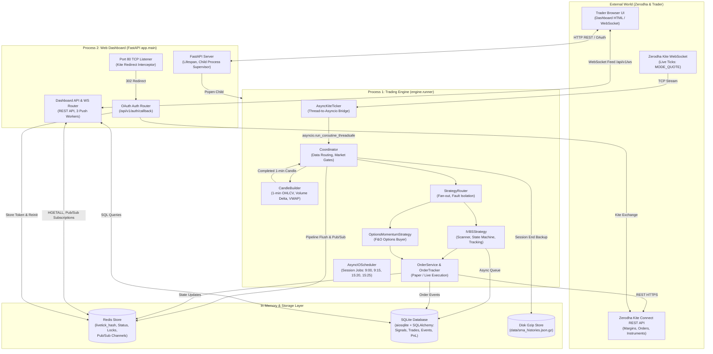
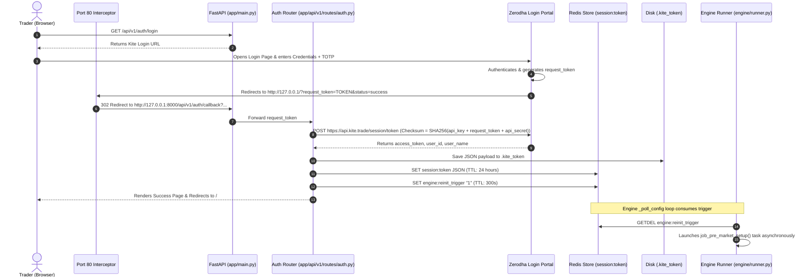
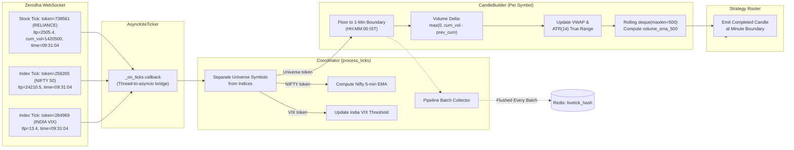
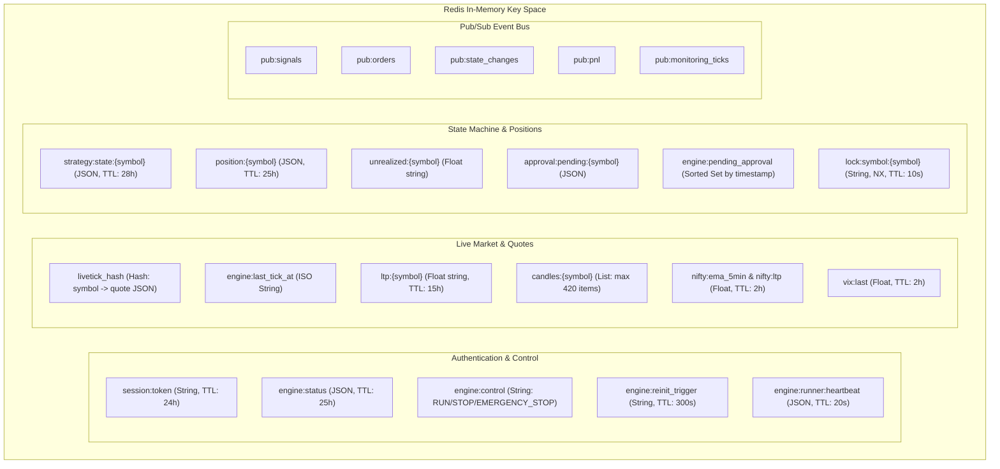
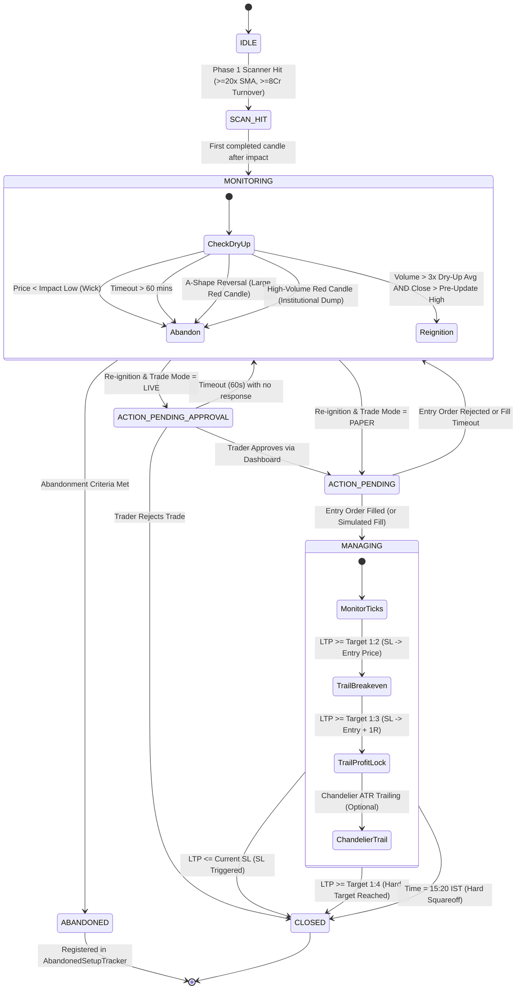
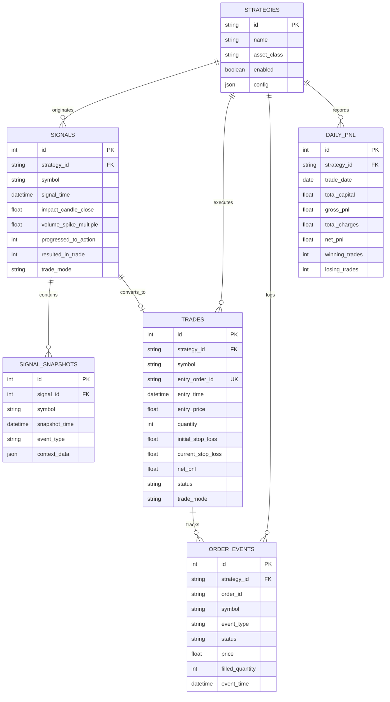

# Architecture Deep Dive: Multi-Strategy Algorithmic Trading Platform

This document provides a comprehensive, production-grade architectural breakdown of the Institutional Volume Breakout Strategy (IVBS) and multi-strategy algorithmic trading platform. It details every directory, file responsibility, authentication mechanism, data ingestion pipeline, Redis memory architecture, strategy state machine, order execution lifecycle, and safety subsystems.

---

## Table of Contents

1. [High-Level Architecture & System Topography](#1-high-level-architecture--system-topography)
2. [Exhaustive Directory & File Structure](#2-exhaustive-directory--file-structure)
3. [Authentication & Login Lifecycle ("login")](#3-authentication--login-lifecycle-login)
4. [Data Ingestion & Market Processing Engine ("data getting every part")](#4-data-ingestion--market-processing-engine-data-getting-every-part)
5. [Redis In-Memory Architecture & IPC ("redis memory data")](#5-redis-in-memory-architecture--ipc-redis-memory-data)
6. [Strategy Framework & Trading Logic ("strategy")](#6-strategy-framework--trading-logic-strategy)
7. [Order Management & Risk Pipeline ("orders")](#7-order-management--risk-pipeline-orders)
8. [Database Schema & Event Persistence](#8-database-schema--event-persistence)
9. [Operational Workflows & Failure Modes](#9-operational-workflows--failure-modes)

---

## 1. High-Level Architecture & System Topography

The platform is designed as a **decoupled, two-process architecture** communicating via **Redis** and persisting to an asynchronous **SQLite database**.



### Key Architectural Tenets
1. **Zero In-Process Coupling Across Boundaries**: The Dashboard (`app/`) and Engine (`engine/`) never import each other's stateful runtime instances. All state synchronization occurs over Redis or the database.
2. **Strict Funnel Event Pipeline**: Real-time ticks flow strictly from `AsyncKiteTicker` $\rightarrow$ `Coordinator` $\rightarrow$ `StrategyRouter` $\rightarrow$ Strategy Plugins.
3. **Pluggable Strategy Contract**: Adding a strategy requires subclassing `BaseStrategy` inside `engine/strategies/<id>/` and registering it in `engine/runner.py`. The engine core remains untouched.
4. **Dual Safety Gates**: Every strategy is subject to centralized Pre-Trade Risk Checks, Circuit Breakers, and idempotency guards before an order reaches Zerodha.

---

## 2. Exhaustive Directory & File Structure

```
d:\volume_algo_trading\trading_bot\
├── alembic/                         # Database schema migrations
│   ├── versions/                    # Linear migration revisions
│   │   ├── 001_initial_schema.py    # Tables: signals, trades, order_events, daily_pnl
│   │   ├── 002_add_trade_mode_column.py # Adds trade_mode (PAPER / LIVE) to trades/signals
│   │   ├── 003_add_target_1r3_column.py # Adds 1:3 profit-lock trail column
│   │   ├── 004_add_strategy_id.py   # Multi-strategy support (strategy_id column & strategies table)
│   │   ├── 005_daily_pnl_composite_unique.py # Composite uniqueness on (trade_date, strategy_id)
│   │   └── 03f052fed285_add_signal_snapshots_table.py # Event sourcing snapshots table
│   └── env.py                       # Alembic async migration environment
├── app/                             # FastAPI Web Application & Dashboard Backend
│   ├── api/
│   │   ├── v1/
│   │   │   └── routes/
│   │   │       └── auth.py          # Kite OAuth v3 login, token exchange, status, token revoke
│   │   └── dashboard_router.py      # REST APIs (positions, signals, scanner, orders) & WebSocket feed
│   ├── core/
│   │   ├── config.py                # Pydantic Settings model loaded from .env
│   │   └── logging.py               # Structlog JSON/Console formatting configuration
│   ├── models/
│   │   └── db/                      # SQLAlchemy 2.0 async declarative models
│   │       ├── base.py              # DeclarativeBase superclass
│   │       ├── daily_pnl.py         # DailyPnl model (session summary statistics)
│   │       ├── order_event.py       # OrderEvent model (audit log for all order state transitions)
│   │       ├── signal.py            # Signal model (Phase 1 scan hit snapshots)
│   │       ├── signal_snapshot.py   # SignalSnapshot model (granular event sourcing during dry-up)
│   │       ├── strategy.py          # Strategy model (registry of strategies & configurations)
│   │       └── trade.py             # Trade model & TradeStatus enumeration
│   ├── static/
│   │   └── dashboard.html           # Single-Page UI (Glassmorphic dark design, vanilla JS, Chart.js)
│   ├── store/
│   │   ├── database.py              # Async SQLAlchemy engine & sessionmaker factory
│   │   └── redis_client.py          # aioredis singleton client pool connection
│   └── main.py                      # FastAPI app entry point, lifespan, port-80 proxy, child engine starter
├── engine/                          # Low-Latency Trading Engine (Runs in child subprocess)
│   ├── runner.py                    # Engine orchestrator, APScheduler jobs, control polling loop
│   ├── backtest/                    # Historical backtesting & simulation subsystem
│   │   ├── data_loader.py           # Parquet / CSV / Kite historical candle loader
│   │   ├── engine.py                # BacktestEngine simulator executing real BaseStrategy code
│   │   ├── metrics.py               # Quant metrics: Sharpe, Sortino, Win Rate, Drawdown, Profit Factor
│   │   ├── portfolio.py             # Cash, position, and portfolio ledger for backtest runs
│   │   └── sim_broker.py            # Simulated broker with realistic intrabar low-to-high tick paths
│   ├── core/                        # Core Engine Framework & Contracts
│   │   ├── base_strategy.py         # Abstract Base Class (ABC) for all strategy plugins
│   │   ├── instrument.py            # Instrument dataclass, AssetClass, Exchange, Product enums
│   │   ├── order_gateway.py         # Normalized order placement gateway interface
│   │   ├── strategy_config.py       # YAML loader for per-strategy config.yaml
│   │   └── strategy_router.py       # Event fan-out dispatcher with fault isolation
│   ├── kite/                        # Zerodha Kite Connect & Ticker Integration
│   │   ├── auth.py                  # Token file loader, validator, and persistent saver
│   │   ├── client.py                # AsyncKiteClient wrapping synchronous kiteconnect in threads
│   │   ├── instruments.py           # Instrument cache, NSE/NFO symbol filters
│   │   └── ticker.py                # AsyncKiteTicker thread-to-asyncio bridge
│   ├── market/                      # Market Data & Structure
│   │   ├── calendar.py              # NSE trading hours, holidays, IST timezone utilities
│   │   ├── candle_builder.py        # Tick-to-1-min candle builder, volume delta, VWAP, ATR
│   │   ├── historical_warmup.py     # Smart sliding-window 500-candle SMA warmup via Kite API
│   │   ├── option_chain.py          # OptionChainResolver (ATM strike, nearest expiry, CE/PE resolution)
│   │   ├── universe.py              # Watchlist loader (universe.txt parser)
│   │   └── watchlist.py             # Hot-reloadable dynamic watchlist synchronization
│   ├── orders/                      # Order Execution & Postback Tracking
│   │   ├── cost_calculator.py       # Statutory charges: STT, exchange turnover, GST, SEBI, stamp duty
│   │   ├── fill_timeout.py          # Watchdog manager cancelling unfilled LIMIT orders after timeout
│   │   ├── order_service.py         # Order placement, modification, retry policy, Paper mode simulator
│   │   └── order_tracker.py         # Order ID registries, postback deduplication, idempotency dispatch
│   ├── risk/                        # Risk Management & Capital Protection
│   │   ├── circuit_breaker.py       # Daily drawdown kill switch with Redis persistence
│   │   ├── margin_tracker.py        # Live margin tracking & safety buffer enforcement
│   │   ├── position_sizer.py        # 1% risk quantity computation & F&O lot sizing
│   │   └── pre_trade_checks.py      # 9 sequential safety checks before order submission
│   ├── store/                       # Storage Interfaces
│   │   ├── db_writer.py             # Asynchronous database writer for business events
│   │   ├── redis_store.py           # Centralized Redis client for ALL engine keys, TTLs, and Pub/Sub
│   │   └── sma_file_store.py        # Gzip JSON file store for 20-day / 500-minute volume histories
│   ├── strategies/                  # Strategy Plugin Packages
│   │   ├── ivbs/                    # Institutional Volume Breakout Strategy (Production)
│   │   │   ├── abandoned_setup_tracker.py # Re-entry tracker for setups that broke low then recovered
│   │   │   ├── config.yaml          # Strategy tunables and parameters
│   │   │   ├── ivbs_config.py       # Strongly typed config singleton mirroring settings
│   │   │   ├── scanner.py           # Phase 1 7-filter impact candle scanner
│   │   │   ├── second_spike_detector.py # Phase 1b second-spike entry detector
│   │   │   ├── state_machine.py     # Per-symbol state machine (IDLE -> SCAN_HIT -> MONITORING -> ACTION -> MANAGING -> CLOSED)
│   │   │   └── strategy.py          # BaseStrategy implementation for IVBS
│   │   └── options_momentum/        # Index Options Momentum Strategy (F&O Demo)
│   │       ├── config.yaml          # Strategy tunables (underlying, risk, product)
│   │       └── strategy.py          # BaseStrategy implementation for buying ATM options
│   └── strategy/                    # Legacy backwards-compatibility shims
│       ├── coordinator.py           # Primary data router (bridges ticker, candle builder, strategies)
│       └── [shims]                  # Forwarding imports for scanner, state_machine, etc.
├── data/                            # Persistent state on disk
│   └── sma_histories.json.gz        # Gzip snapshot of 500-period volume SMAs
├── scripts/                         # Operational & diagnostic tools
│   ├── kite_port80_redirect.py      # Standalone Windows port-80 redirect server
│   ├── redis_diag.py                # Redis connectivity and key inspector
│   ├── verify_system.py             # System prerequisite check
│   └── run_backtest.py              # CLI backtest launcher
├── tests/                           # Pytest Test Suite
│   ├── conftest.py                  # Test fixtures: fake_redis, in-memory SQLite, paper settings
│   ├── unit/                        # Unit tests for state machine, scanner, sizing, router
│   └── integration/                 # End-to-end simulated trading workflows
├── .env                             # Active environment configuration
├── .kite_token                      # Stored Kite OAuth access token payload
├── universe.txt                     # Active stock universe (NSE equity symbols)
└── start.bat                        # Production launcher script (Redis, Backend, Dashboard)
```

---

## 3. Authentication & Login Lifecycle ("login")

Zerodha Kite Connect v3 uses a strict OAuth 2.0 flow. Access tokens are valid until **06:00 AM IST** the following morning.



### 3.1 The Port-80 Redirect Challenge & Dual Interceptor
In the Zerodha Developer Console, the registered Redirect URL is restricted to `http://127.0.0.1` (no custom ports or subpaths permitted). When Zerodha redirects, it hits port 80.
- **Primary Listener**: `app/main.py` starts an internal async server on `127.0.0.1:80` inside its `lifespan` handler (`handle_port80_redirect`). It intercepts raw HTTP GET requests and immediately replies with an HTTP `302 Found` to `http://127.0.0.1:8000/api/v1/auth/callback?{query}`.
- **Safety Net**: If port 80 cannot be bound (e.g. non-admin privileges), `scripts/kite_port80_redirect.py` can be run independently as Administrator. Additionally, `app/main.py` catches any incoming `request_token` query parameter hitting `GET /` and redirects it.

### 3.2 Dual Token Storage & Pre-Market Validation
Tokens are saved redundantly:
1. **File (`.kite_token`)**: Survives server reboots and Redis flushes. Contains `access_token`, `api_key`, `user_id`, `user_name`, `login_time`, `generated_at`.
2. **Redis (`session:token`)**: Fast access across process boundaries.
- **Engine Validation**: In `job_pre_market_setup()` (`engine/runner.py`), `load_token()` checks `.kite_token` first, then Redis. It initializes `kiteconnect.KiteConnect` and calls `validate_token(kite, token)` which executes `kite.profile()`. If invalid or expired, engine status is set to `AUTH_EXPIRED` or `AUTH_REQUIRED`.

### 3.3 SEBI Static IP Compliance Probe
SEBI regulations mandate static IP registration for algo-trading order APIs. The engine verifies compliance in Step 1.5 of `job_pre_market_setup()` by issuing a dummy margin check (`_kite_client.order_margins`) for a 1-share NSE MIS market order. If rejected due to network/IP restrictions, engine status transitions immediately to `IP_REJECTED` and shuts down.

---

## 4. Data Ingestion & Market Processing Engine ("data getting every part")

The data engine converts unstructured market ticks into rolling statistical structures.



### 4.1 Kite Ticker Architecture
- **Class**: `AsyncKiteTicker` (`engine/kite/ticker.py`).
- **Subscription Mode**: `MODE_QUOTE` for all universe stocks (provides LTP, cumulative day volume, OHLC, exchange timestamp). `MODE_LTP` is used for indices (Nifty 50 and India VIX) to minimize bandwidth.
- **Thread Bridge**: The underlying KiteTicker spawns an internal thread. The callback `_on_ticks` uses `asyncio.run_coroutine_threadsafe(self._coordinator.process_ticks(ticks), self._loop)` to transfer control safely to the main asyncio loop without cross-thread lock contention.

### 4.2 Minute Candle Construction & Volume Delta Arithmetic
- **Class**: `CandleBuilder` (`engine/market/candle_builder.py`).
- **Time Bucketing**: Driven strictly by `exchange_timestamp` floored to the minute boundary:
  $$\text{candle\_minute} = \text{exchange\_ts}.\text{replace}(\text{second}=0, \text{microsecond}=0)$$
- **Volume Delta Calculation**:
  Kite provides cumulative day volume ($V_{\text{cum}}$). Intrabar minute volume delta is calculated as:
  $$\Delta V = \max(0, V_{\text{cum}} - V_{\text{prev\_cum}})$$
- **Bug 4 Fix (Reconnect Phantom Volume Spike)**:
  When WebSocket reconnects occur, Zerodha may replay pre-open volume or drop cumulative counts. `CandleBuilder.reset_cumulative_baseline()` sets `_awaiting_baseline_reset = True`. The first tick received after reconnect is used solely to calibrate $V_{\text{prev\_cum}}$, assigning zero volume credit and preventing phantom spikes.

### 4.3 Rolling 500-Minute Volume SMA & Warmup Hierarchy
To detect $20\times$ volume spikes, each symbol maintains an exact moving average of the last 500 one-minute candles ($500 \text{ minutes} \approx 1.33 \text{ trading days}$, using a standard 375 minutes/day):
$$\text{SMA}_{500} = \frac{1}{500} \sum_{i=1}^{500} V_i$$
- **Storage**: `collections.deque(maxlen=500)`.
- **Pre-Market Loading Hierarchy**:
  1. **Local Compressed Disk File (`data/sma_histories.json.gz`)**: Loaded at 09:00 AM via `sma_file_store.py`. High-speed, persistent across Redis reboots.
  2. **Redis (`volume_sma:{symbol}`)**: 48-hour TTL fallback. Whichever source contains more history is loaded into the builder deque.
  3. **Kite REST API Gap Warmup (`engine/market/historical_warmup.py`)**: If the saved data is $N$ days stale, the engine queries `kite.historical_data` for 1-minute candles covering only the missing gap days, sliding the deque until full.

### 4.4 Real-Time Market Feed to Web UI
Ticks are pushed to the frontend using a hybrid Redis caching and WebSocket broadcast model:
1. **Pipeline Batch Flush**: In `Coordinator.process_ticks()`, every tick update is buffered and written to Redis in a single atomic pipeline executing `hset("livetick_hash", symbol, json)` and updating `engine:last_tick_at`.
2. **Dashboard WebSocket Server (`app/api/dashboard_router.py`)**:
   - **Heartbeat Task (every 5s)**: Sends full engine status, open positions, scanner counts, and capital.
   - **Tick Batch Task (every 1s)**: Executes `HGETALL livetick_hash` (O(1) complexity) and pushes all active prices and percent changes to the client.
   - **Pub/Sub Task (event-driven)**: Subscribes to Redis `pub:signals`, `pub:orders`, `pub:state_changes`, `pub:pnl`, and `pub:monitoring_ticks`, forwarding events instantaneously to the UI.

---

## 5. Redis In-Memory Architecture & IPC ("redis memory data")

Redis acts as the shared nervous system between the Trading Engine child process and the FastAPI dashboard server.



### 5.1 Redis Key Space Reference

| Redis Key / Pattern | Data Type | TTL | Writers | Readers | Description & Purpose |
|---|---|---|---|---|---|
| `session:token` | String (JSON) | 86,400s (24h) | `app.auth` | `engine.runner` | Active Kite access token and user metadata |
| `engine:status` | String (JSON) | 90,000s (25h) | `engine.runner` | `app.dashboard` | Engine operational status (`ONLINE`, `SCANNING`, `STOPPING`, stats) |
| `engine:control` | String | None | `app.dashboard` | `engine.runner` | Operator commands (`START`, `STOP`, `EMERGENCY_STOP`) |
| `engine:runner:heartbeat` | String (JSON) | 20s | `engine.runner` | `app.main` | Heartbeat pulse proving runner PID is alive |
| `engine:reinit_trigger` | String | 300s | `app.auth` | `engine.runner` | Signals engine to re-run pre-market setup after auth |
| `engine:pending_watchlist`| String (JSON) | 300s | `app.dashboard` | `engine.runner` | Holds edited symbol list for hot-reload |
| `engine:circuit_breaker` | String (bool) | 90,000s (25h) | `engine.risk` | `engine.runner` | Set to `"true"` when daily drawdown limit is hit |
| `engine:capital` | String (float)| 90,000s (25h) | `engine.runner` | `engine.risk`, `app` | Effective equity for position sizing |
| `engine:daily_pnl` | String (float)| 90,000s (25h) | `engine.state` | `app.dashboard` | Cumulative daily realized P&L |
| `engine:blocked_margin` | String (float)| 90,000s (25h) | `engine.orders` | `engine.risk` | Real-time margin blocked by open positions |
| `livetick_hash` | Hash (symbol $\to$ JSON) | None | `engine.coordinator`| `app.dashboard` | High-performance O(1) table of all live stock quotes |
| `engine:last_tick_at` | String (ISO) | 54,000s (15h) | `engine.coordinator`| `app.dashboard` | Timestamp of latest tick batch for UI staleness alert |
| `candles:{symbol}` | List (JSON) | 54,000s (15h) | `engine.coordinator`| `app.dashboard` | Last 420 completed 1-min candles for chart drawers |
| `strategy:state:{symbol}`| String (JSON) | 100,800s (28h)| `engine.state` | `app.dashboard` | State machine snapshot (phase, trigger, SL, counts) |
| `position:{symbol}` | String (JSON) | 90,000s (25h) | `engine.state` | `app.dashboard` | Open position details (entry price, qty, SL levels) |
| `unrealized:{symbol}` | String (float)| 54,000s (15h) | `engine.state` | `app.dashboard` | Lightweight live P&L key updated on every tick |
| `lock:symbol:{symbol}` | String (NX) | 10s | `engine.state` | `engine.state` | Distributed mutex preventing duplicate exit orders |
| `engine:pending_approval`| Sorted Set | None | `engine.state` | `app.dashboard` | Live trade approval queue ordered by epoch timestamp |
| `approval:pending:{sym}` | String (JSON) | None | `engine.state` | `app.dashboard` | Full pre-computed order parameters for approval modal |

### 5.2 Pub/Sub Event Channels
- `pub:signals`: Emits scan hits, second-spike triggers, and approval requests.
- `pub:orders`: Emits placement, cancellation, and fill events.
- `pub:state_changes`: Emits state transitions (`MONITORING` $\to$ `MANAGING`) and SL trailing milestones (1:2 breakeven, 1:3 profit lock).
- `pub:pnl`: Emits real-time realized P&L updates.
- `pub:monitoring_ticks`: High-frequency channel (throttled to 1Hz per symbol) streaming live tick updates for symbols actively in `SCAN_HIT` or `MONITORING`.

---

## 6. Strategy Framework & Trading Logic ("strategy")

### 6.1 BaseStrategy Plugin Architecture
Every strategy implements `BaseStrategy` (`engine/core/base_strategy.py`).
- **Isolation**: Each strategy runs independently; no strategy may import another.
- **Fault Tolerance**: The `StrategyRouter` (`engine/core/strategy_router.py`) encapsulates all strategy invocations in `try/except Exception` blocks. An uncaught error in Strategy A is logged with full traceback and cannot crash the engine or affect Strategy B.

### 6.2 IVBS Strategy (Institutional Volume Breakout Strategy)



#### Phase 1: Scanner Logic (`engine/strategies/ivbs/scanner.py`)
Applies 7 strict filters in fail-fast sequence:
1. **Opening Noise Guard**: Ignores candles before 09:30 AM IST (clears opening auction distortions).
2. **Late-Session Guard**: Ignores candles after 14:00 PM IST (insufficient time for multi-phase setup).
3. **Market Gate**: Evaluates Nifty 50 20-period 5-min EMA. If Nifty LTP < EMA, new entries are blocked.
4. **SMA Warmup & Validity**: Requires $\text{SMA}_{500} > 0$ and complete historical buffer.
5. **Volume Spike Multiple**: $\text{Candle Volume} \ge 20.0 \times \text{SMA}_{500}$.
6. **Turnover Floor**: $\text{Turnover} \ge ₹8 \text{ Crore}$ ($₹80,000,000$). If India VIX > 18.0, the turnover floor rises dynamically to $₹12 \text{ Crore}$.
7. **Anti-Dump Filter**: $\text{Close} \ge \text{Open} \times 0.995$ (rejects heavy red sell dump candles).

#### Phase 2: Consolidation & Dry-Up Monitoring (`state_machine.py`)
Tracks institutional absorption.
- **Bug 3 Fix (Wick Low)**: `ConsolidationData.swing_low` tracks the absolute lowest candle wick (`low`), not the close, capturing institutional liquidity sweeps.
- **Bug 1 & 2 Fix (Pre-Update Snapshots)**: The breakout level ($H_{\text{breakout}}$) and dry-up volume baseline ($V_{\text{ref}}$) are captured **before** updating the consolidation with the current candle.
- **Abandonment Conditions**:
  - **Breakdown**: Candle wick low penetrates below impact candle low ($L_{\text{impact}} \times (1 - 0.003)$).
  - **Timeout**: Dry-up exceeds 60 minutes.
  - **A-Shape Reversal**: Red candle with range $> 1.5\%$ on volume $> 2.0\times$ average dry-up.
  - **Institutional Exit Pressure**: Candle volume $> 30\%$ of impact volume on a **red** candle. (High volume on a green candle is classified as bullish absorption and allowed to continue).

#### Phase 3: Re-ignition & Entry Trigger
Triggers an entry when:
1. Minimum dry-up duration met ($\ge 3$ completed candles).
2. Volume exceeds dry-up baseline: $\text{Volume} > 3.0 \times \text{mean}(V_{\text{dryup}})$.
3. Absolute volume floor cleared: $\text{Volume} \ge 0.08 \times V_{\text{impact}}$.
4. Breakout: $\text{Close} > H_{\text{breakout}}$ (pre-update snapshot).
5. Green candle: $\text{Close} > \text{Open}$.
6. Optional VWAP confirmation: $\text{Close} \ge \text{Session VWAP}$.

#### Advanced Branches: Second Spikes & Re-Entries
- **Second Spike Detector (`second_spike_detector.py`)**: If a stock produces an impact spike, pulls back without breaking the low, and produces a second volume spike within 15–90 minutes, it enters immediately, bypassing the dry-up phase. The stop-loss is anchored 1 tick below the inter-spike consolidation low.
- **Abandoned Setup Re-Entry (`abandoned_setup_tracker.py`)**: If a setup was abandoned due to a temporary probe below the impact low, but subsequently re-crosses above the impact close on above-average volume, a re-entry trade is triggered.

---

## 7. Order Management & Risk Pipeline ("orders")

### 7.1 Pre-Trade Checks (`engine/risk/pre_trade_checks.py`)
Before any order reaches Zerodha, it must pass 9 sequential checks:
1. **Circuit Breaker**: Daily net loss limit not breached.
2. **Concurrent Positions**: Open managing positions $< \text{MAX\_CONCURRENT\_POSITIONS}$ (default 3).
3. **Market Hours**: Market is currently open (09:15–15:30 IST).
4. **Entry Cutoff**: Current time $< 14:00$ IST.
5. **Risk Per Share**: $\text{Limit Price} - \text{Stop Loss} \ge ₹1.00$.
6. **Quantity**: Computed quantity $\ge 1$.
7. **Margin Availability**: Total blocked margin + new margin $\le$ available cash balance.
8. **Peak Margin Buffer**: Margin outlay maintains a $15\%$ safety buffer.
9. **SMA Warmup**: Symbol volume builder has completed warmup.

### 7.2 Position Sizing Formulation
- **Equity (1% Capital Risk)**:
  $$\text{Risk Amount} = \text{Capital} \times \frac{\text{RISK\_PER\_TRADE\_PCT}}{100}$$
  $$\text{Risk Per Share} = \text{Limit Price} - \text{Stop Loss}$$
  $$\text{Quantity} = \max\left(1, \left\lfloor \frac{\text{Risk Amount}}{\text{Risk Per Share}} \right\rfloor\right)$$
- **F&O Lot Sizing (`compute_lots`)**:
  $$\text{Lots} = \min\left(\left\lfloor \frac{\text{Risk Amount}}{\text{Risk Per Unit} \times \text{Lot Size}} \right\rfloor, \text{Max Lots}, \left\lfloor \frac{\text{Capital} \times \text{Max Premium Exposure}}{\text{Entry Price} \times \text{Lot Size}} \right\rfloor\right)$$

### 7.3 Multi-Stage Trade Management & Trailing SL
Once in `MANAGING` state, the position is monitored on every incoming tick:
1. **Initial Stop-Loss**: Placed at $\text{Swing Low} - 1 \text{ tick}$ ($0.05$).
2. **1:2 Target (Breakeven Trail)**:
   When $\text{LTP} \ge \text{Entry} + 2 \times \text{Risk Per Share}$:
   $$\text{Stop Loss} \leftarrow \text{Entry Price}$$
3. **1:3 Target (Profit Lock Trail)**:
   When $\text{LTP} \ge \text{Entry} + 3 \times \text{Risk Per Share}$:
   $$\text{Stop Loss} \leftarrow \text{Entry Price} + 1 \times \text{Risk Per Share}$$
4. **Chandelier ATR Trailing (Optional)**:
   After breakeven is reached, the stop ratchets upward dynamically:
   $$\text{Stop Loss} \leftarrow \max(\text{Current SL}, \text{Highest Price} - 2.0 \times \text{ATR}_{14})$$
5. **1:4 Hard Target**:
   When $\text{LTP} \ge \text{Entry} + 4 \times \text{Risk Per Share}$, a full market exit is executed.
6. **Time-Based Squareoff**:
   - **15:18 IST**: Early squareoff check. If $>1$ position is open, initiates market exit early to prevent broker auto-squareoff penalties.
   - **15:20 IST**: Hard squareoff forces market exits on all open positions.

### 7.4 Idempotency, Concurrency Locks & Order Reconciliation
- **Redis NX Exit Lock**: Before executing an exit, the engine calls `RedisStore.acquire_symbol_lock(symbol)` using `SET lock:symbol:{sym} "locked" NX EX 10`. This prevents race conditions where an SL-M trigger postback and a target-hit WebSocket event attempt to close the same position simultaneously.
- **5-Minute Reconciliation Loop (`job_reconcile`)**: Queries `kite.orders()` every 5 minutes during market hours. Any status transitions missed due to WebSocket drops are detected and processed idempotently.
- **Partial Fill Handling**: If an entry order is cancelled or rejected with `filled_quantity > 0`, the engine transitions to `MANAGING` for the filled portion, placing an SL-M for the exact filled quantity.

---

## 8. Database Schema & Event Persistence

The relational database is powered by asynchronous SQLite (`trading.db`).



---

## 9. Operational Workflows & Failure Modes

### 9.1 Daily Automated Schedule
- **08:50 AM**: Engine process started (manual or via `start.bat`).
- **09:00 AM (`job_pre_market_setup`)**: Validates Kite token, fetches capital, resets daily state, downloads NSE/NFO instruments, loads 500-minute SMA history, performs sliding-window gap warmup, subscribes to WebSocket, checks for orphan positions.
- **09:15 AM (`job_market_open`)**: Resets candle builders, enables strategy scanner.
- **09:30 AM**: Scanner opening-noise guard lifts; scanning activates.
- **14:00 PM**: Entry cutoff reached; no new scan hits processed.
- **15:18 PM (`job_early_squareoff_check`)**: Closes positions early if $>1$ position active.
- **15:20 PM (`job_squareoff`)**: Emergency hard squareoff of all remaining open positions.
- **15:25 PM (`job_session_end`)**: Persists volume SMA history to disk/Redis, writes `daily_pnl` summary to database, unregisters WebSocket.

### 9.2 Operator Control States & Emergency Actions
Operators control the engine via the dashboard UI (`POST /api/v1/emergency_stop`, `/stop`, `/start`):
- `EMERGENCY_STOP`: Engine immediately cancels all pending orders, places market exit orders for all open positions, sets status to `EMERGENCY_STOP`, and terminates.
- `STOP`: Graceful stop. Disables new entries (`new_entries_enabled = False`); existing positions continue to be monitored and trailed until target, stop-loss, or 15:20 PM.
- `START`: Re-enables new entries and forces market open state.

### 9.3 Failure Recovery Matrix

| Failure Event | Detection Mechanism | Automated Engine Response |
|---|---|---|
| **WebSocket Disconnect** | `AsyncKiteTicker.on_reconnect` | Ticker retries automatically with exponential backoff. Baselines reset on reconnect (`reset_cumulative_baseline`). |
| **Fatal WS Disconnect** | `AsyncKiteTicker.on_noreconnect` | Triggers `on_fatal_disconnect()`. All strategies immediately square off open positions. Engine status $\to$ `FATAL_DISCONNECT`. |
| **Missed Order Postback** | Periodic 5-min `job_reconcile` | Reconciles against `kite.orders()`. Fills or cancellations missed on WS are routed to state machines idempotently. |
| **Crash with Open Position**| Startup `orphan_check` | At 09:00 AM, compares Kite net positions against Redis state. Any untracked Kite position is closed via emergency market sell. |
| **Ghost Position in Redis** | Startup `orphan_check` | Redis shows `MANAGING` but Zerodha net position is zero. Clears stale Redis keys and updates database trade status to `CLOSED_BROKER`. |
| **SL-M Placement Rejection**| `order_tracker.on_postback` | If an SL order is rejected (`REJECTED`), the position is unprotected. Engine immediately fires an emergency market exit sell. |
